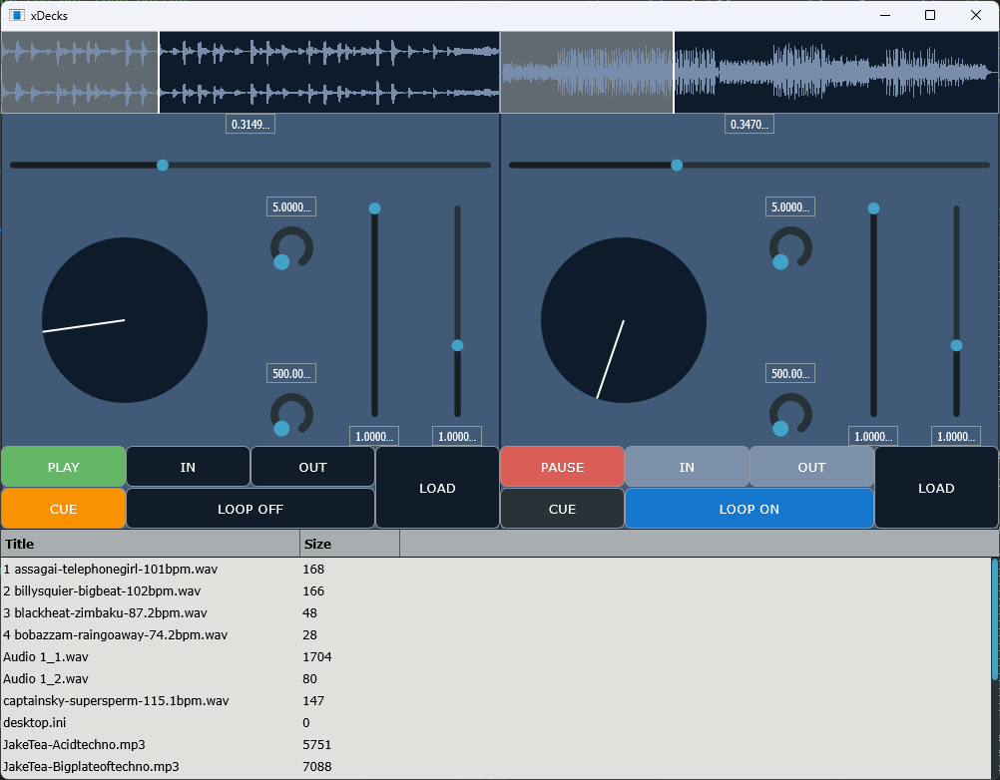

# xDecks Application

## Overview
xDecks is a DJ application built using the JUCE framework. It provides a user-friendly interface for mixing and playing audio tracks. The application includes features such as waveform display, audio playback control, looping, and filtering.

## Features
- **Waveform Display**: Visual representation of the audio waveform.
- **Playback Control**: Play, pause, and cue functionalities.
- **Looping**: Set loop points and enable/disable looping.
- **Filtering**: High-pass and low-pass filters.
- **Playlist Management**: Load and display audio tracks from a specified folder.

## Prerequisites
Before you can run the xDecks application, ensure you have the following installed on your computer:

- **JUCE Framework**: Download and install JUCE from JUCE's official website.
- **C++ Compiler**: Ensure you have a C++ compiler installed (e.g., GCC, Clang, MSVC).
- **Projucer**: Ensure you have Projucer installed for building the project.
- **CMake** (optional): Instead of Projucer you can use CMake 
  
### JUCE modules used:
- juce_audio_basics
- juce_audio_devices
- juce_audio_formats
- juce_audio_processors
- juce_audio_utils
- juce_core
- juce_cryptography
- juce_data_structures
- juce_dsp
- juce_events
- juce_graphics
- juce_gui_basics
- juce_gui_extra
- juce_opengl

## Setup Instructions
Follow these steps to set up and run the xDecks application on your computer or download the xDecks.exe file to run the program on your computer:

1. **Clone the Repository**  
   Clone the xDecks repository to your local machine using the following command:
   
   git clone <repository-url>

2. **Open the Project in Projucer**  
   Launch the Projucer application from the JUCE installation directory.  
   Open the `xDecks.jucer` project file located in the cloned repository.  
   Configure the project settings as needed (e.g., set the desired export target).

3. **Build the Project**  
   Save the project in Projucer.  
   Click on the "Save and Open in IDE" button to open the project in your preferred IDE (e.g., Visual Studio, Xcode).  
   Build the project in your IDE.

4. **Run the Application**  
   After successfully building the project, run the application from your IDE. The xDecks application window should appear, displaying the DJ interface.

## Usage

### Main Components
- **DeckGUI**: The main interface for controlling audio playback, including play, pause, cue, and loop functionalities.
- **WaveformDisplay**: Displays the waveform of the loaded audio track.
- **PlaylistComponent**: Manages and displays the list of audio tracks available for playback.

### Controls
- **Play Button**: Starts or pauses audio playback.
- **Cue Button**: Sets or jumps to the cue point.
- **Load Button**: Opens a file chooser to load an audio file.
- **Loop Button**: Toggles loop mode on or off.
- **In/Out Loop Buttons**: Sets the loop start and end points.
- **Volume Slider**: Adjusts the playback volume.
- **Speed Slider**: Adjusts the playback speed.
- **Position Slider**: Seeks to a specific position in the track.
- **High/Low Pass Filter Knobs**: Adjusts the high-pass and low-pass filter frequencies.

## Contributing
If you would like to contribute to the xDecks project, please follow these steps:

1. Fork the repository.
2. Create a new branch for your feature or bug fix.
3. Commit your changes and push them to your forked repository.
4. Create a pull request to merge your changes into the main repository.

## License
This project is licensed under the MIT License. See the LICENSE file for details.

## Acknowledgements
- **JUCE Framework** for providing the tools and libraries necessary to build this application.
